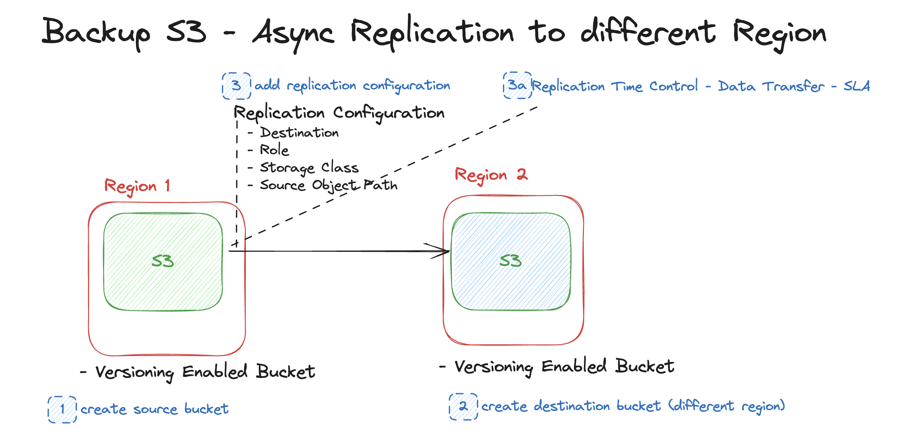

# AWS - S3 Backup objects cross region with replication
The purpose of this excercise is to demonstrate how to use S3 Replication Configuration to Backup S3 Objects to a different Region

Replication Configuration has a 15m completion SLA in most of the cases this can be a feasible option.

Replication enables automatic, asynchronous copying of objects across Amazon S3 buckets. Buckets that are configured for object replication can be owned by the same AWS account or by different accounts. You can replicate objects to a single destination bucket or to multiple destination buckets. The destination buckets can be in different AWS Regions or within the same Region as the source bucket.

## Requirements
1. Create a Source and Destination Bucket (different regions)
    1. Populate the Source Bucket with some objects
1. Set up Replication for Backup purposes
1. Upload new Object to Source Bucket
1. Examine the behavior
1. Clean up the environment

## Desired Architecture

## Resources
1. [Replicating S3 objects](https://docs.aws.amazon.com/AmazonS3/latest/userguide/replication.html)