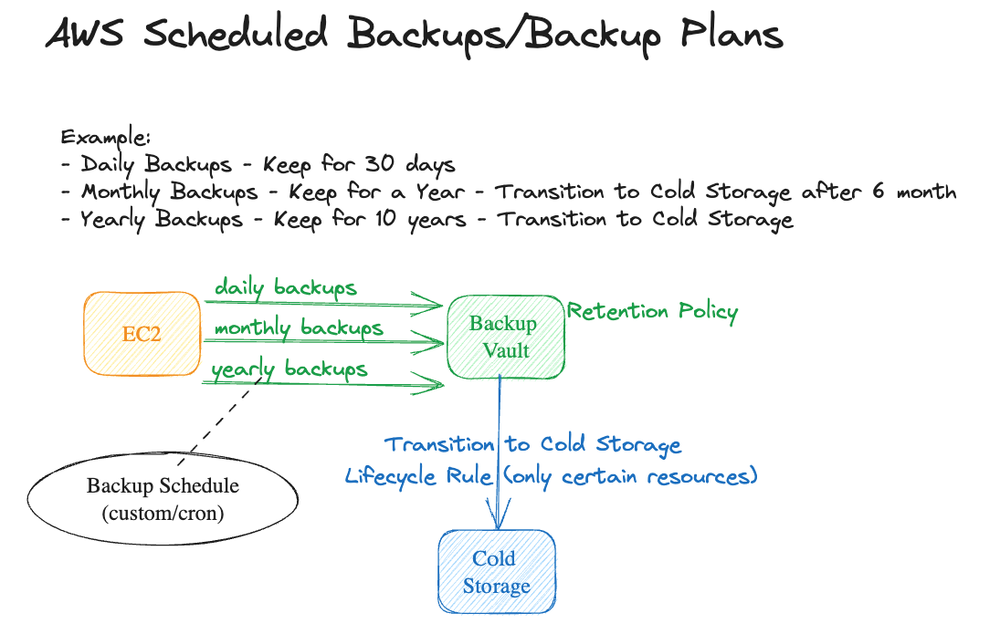

# AWS Backup - Scheduled Backups / Backup Plans
The purpose of this excercise is to demonstrate how schedule backups using AWS Backup Service. Also Backup Plans feature are awesome. You have a greate flexibility using the AWS Backup Service

## Requirements
1. Create an EC2 Instance (defaults are file)
1. Create a Backup Vault
1. Create a Backup Plan
    1. Backup the EC2 Instance
        1. every day - keep the backup for 30 days
        1. every month - keep the backup for a year - transition to _Cold Storage_ after 6 months
        1. every year - keep the backup for 10 years - transition to _Cold Storage_ immidietly
1. Clean up the environment

## Desired Architecture

## Resources
1. [Backup Features](https://docs.aws.amazon.com/aws-backup/latest/devguide/whatisbackup.html#features-by-resource)
1. [AWS CLI List Backup Plans](https://awscli.amazonaws.com/v2/documentation/api/latest/reference/backup/list-backup-plans.html)