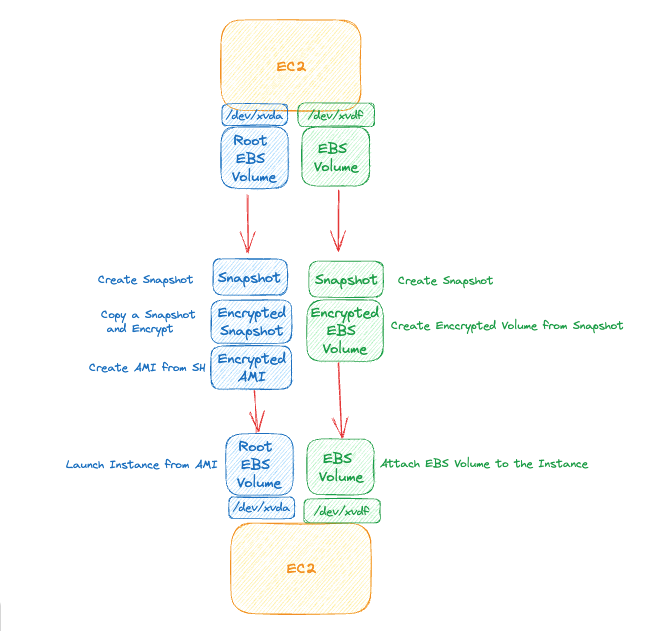

# AWS EC2 EBS - Encrypt unencrypted Volumes of EC2 Instance
- The purpose of this excercise to show how to encrypt an unencrypted EBS Volume attached to an EC2 Instance. 

## Requirements
- Create the Scenario
    - Create an EC2 Instance with a Root volume and an additonal attached Volume
- Encrypt both Root Volume and the additional attached Volume
- EC2 Instance Downtime is not an issue

## Desired Architecture


## Tips and Tricks
#### Check Files systyem and storage space
```sh
# The df command is used to display the disk space used in the file system. The df stands for "disk filesystem." It defines the number of blocks used, the number of blocks available, and the directory where the file system is mounted.
df -h
```
#### Check Volumes with detailed file system information
```sh
# lsblk is a command-line utility used for listing block devices on a Linux system.
lsblk --fs
```

#### Create File System on an attached Volume
```sh
#
mkfs -t ext4 /dev/xvdf
```

#### Mount a formatted volume to a directory
```sh
# Mount the Filesystem
mount /dev/xvdf /<some-directory>
```

## Resources
1. [EBS and Encryption](https://docs.aws.amazon.com/AWSEC2/latest/UserGuide/EBSEncryption.html#encryption-by-default)
1. [lsblk manuals](https://man7.org/linux/man-pages/man8/lsblk.8.html)
1. [mount manuals](https://linux.die.net/man/8/mount)
1. [mkfs manuals](https://linux.die.net/man/8/mkfs)