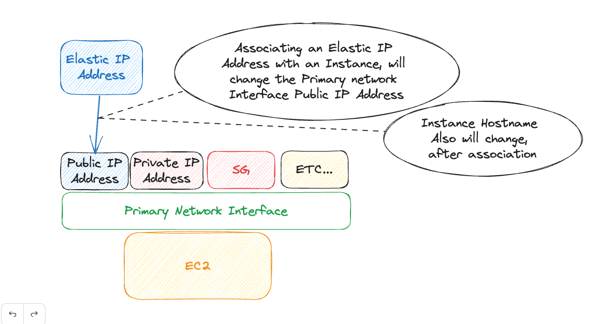

# AWS EC2 - Discovering Elastic IP Address
An _Elastic IP address_ is a static IPv4 address designed for dynamic cloud computing. In the following excercise I would like you to discover how does it work, by creating resources.

## Requirements
- Create An Elastic IP Address
- Create An EC2 Instance
    - Public Subnet
    - Have SSH Key pairs deployed with it
- Associate the Instance with the Elastic IP Address
    - Look at what happens with the isntance

## Desired Architecture

## Resources
[Elastic IP Address Documentation](https://docs.aws.amazon.com/AWSEC2/latest/UserGuide/elastic-ip-addresses-eip.html)