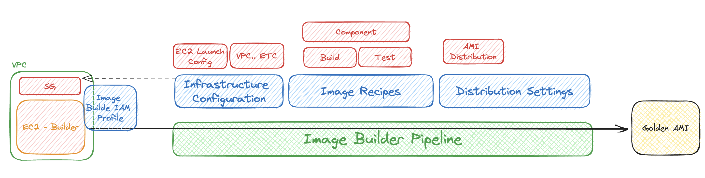

# AWS EC2 - EC2 Imabe Builder Excercise
The purpose of this excercise is to demonstrate the capabilities of EC2 Image Builder. With EC2 Image Builder an Automated Pipeline can be created.

## Requirements
- Use Ubuntu 22 base image
- Use EC2 Image Builder to Create an AMI
- Create a custom recipe to install Node.js 20 Runtime
- Install SSM agent
- Test the AMI by launching an EC2

## Desired Architecture


## Tips and Tricks
#### EC2  Image Builder Component for Ubuntu 22
```yaml
name: NodeJSRuntimeOnUbuntu22
description: This is hello world testing document.
schemaVersion: 1.0

phases:
  - name: build
    steps:
      - name: InstallNodejs
        action: ExecuteBash
        inputs:
          commands:
            - echo "Download and import the Nodesource GPG key"
            - sudo apt-get update
            - sudo apt-get install -y ca-certificates curl gnupg
            - sudo mkdir -p /etc/apt/keyrings
            - curl -fsSL https://deb.nodesource.com/gpgkey/nodesource-repo.gpg.key | sudo gpg --dearmor -o /etc/apt/keyrings/nodesource.gpg
            - echo "Create deb repository"
            - NODE_MAJOR=20
            - echo "deb [signed-by=/etc/apt/keyrings/nodesource.gpg] https://deb.nodesource.com/node_$NODE_MAJOR.x nodistro main" | sudo tee /etc/apt/sources.list.d/nodesource.list
            - echo "Install Node.js"
            - sudo apt-get update
            - sudo apt-get install nodejs -y
           
  - name: validate
    steps:
      - name: ValidatedNodejsAndNpm
        action: ExecuteBash
        inputs:
          commands:
            - node -v
            - npm -v

  - name: test
    steps:
      - name: TestNodejsInstallation
        action: ExecuteBash
        inputs:
          commands:
            - node -v
            - npm -v
```

## Resources
1. [AWS EC2 Image Builder Documentation](https://docs.aws.amazon.com/imagebuilder/latest/userguide/what-is-image-builder.html)
1. [AWS EC2 Image Builder Components Documentation in Details!!](https://docs.aws.amazon.com/imagebuilder/latest/userguide/toe-use-documents.html)
1. [Installing Node.js 20 from source](https://github.com/nodesource/distributions)