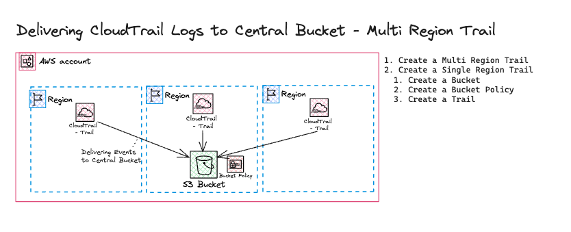

# AWS CloudTrail - Multi Region Trail and Single Region Trail
- While the events provided in Event history in the CloudTrail console are useful for reviewing recent management event activity, they are limited to recent activity, and they do not include all possible events that can be recorded by CloudTrail, such as data and Insights events. Additionally, your view of events in the console is limited to the AWS Region where you are signed in. To create an ongoing record of activity in your AWS account that captures information for all AWS Regions, you can create a trail. By default, when you create a trail in the CloudTrail console, the trail logs events in all AWS Regions in the AWS partition in which you are working. Logging events in all Regions in your account is a recommended best practice.
- The purpose of this exercise is to gain knowledge of the different components of AWS CloudTrail. By Setting up a trail an investigating the different resources you will be familiar with the basic audit capabilities of AWS Resources.

## Exercise Requirements
1. Create a multi Region Trail
1. Create a single Region Trail
    1. Create a Bucket
    1. Create a Bucket Policy
    1. Create a Trail
1. Clean Up! Don't Forget to Delete the Resources!

## Quick Overview


## Tips and Tricks
#### AWS CloudTrail Bucket Policy
```json
{
    "Version": "2012-10-17",
    "Statement": [
        {
            "Sid": "AWSCloudTrailAclCheck20150319",
            "Effect": "Allow",
            "Principal": {"Service": "cloudtrail.amazonaws.com"},
            "Action": "s3:GetBucketAcl",
            "Resource": "arn:aws:s3:::myBucketName",
            "Condition": {
                "StringEquals": {
                    "aws:SourceArn": "arn:aws:cloudtrail:region:myAccountID:trail/trailName"
                }
            }
        },
        {
            "Sid": "AWSCloudTrailWrite20150319",
            "Effect": "Allow",
            "Principal": {"Service": "cloudtrail.amazonaws.com"},
            "Action": "s3:PutObject",
            "Resource": "arn:aws:s3:::myBucketName/[optionalPrefix]/AWSLogs/myAccountID/*",
            "Condition": {
                "StringEquals": {
                    "s3:x-amz-acl": "bucket-owner-full-control",
                    "aws:SourceArn": "arn:aws:cloudtrail:region:myAccountID:trail/trailName"
                }
            }
        }
    ]
}
```

#### Creating a Single Region Trail
```sh
aws cloudtrail create-trail --name regional --s3-bucket-name aws-cloudtrail-logs-589856297973-eu-central-1
```

## Resources
1. [S3 Bucket Policy](https://docs.aws.amazon.com/awscloudtrail/latest/userguide/create-s3-bucket-policy-for-cloudtrail.html)
1. [AWS CloudTrail Documentation](https://docs.aws.amazon.com/awscloudtrail/latest/userguide/cloudtrail-user-guide.html)

