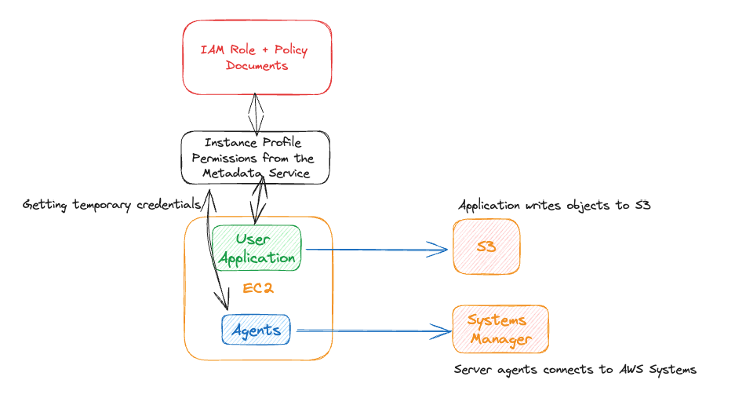

# AWS EC2 - Create and use an Instance Profile
- The purpose of this excercise is to demonstrate the capabilities and the nature of Instance Profile and Temporary credentials. Applications and different server agents can use these temporary short lived credentials.

## Exercise Requirements
1. Create an EC2 Instance in the Default Subnet - Assign a Public IP
    - Use the default AL2023 Image
1. Create an S3 Bucket - ()
1. Create an IAM Role / Instance Profile
    - Allow access to the S3 Bucket
    - Allow access to Systems Manager having the SSM Agent send data to the Systems Manager
1. Create the EC2 Instance
    - have the Instance Profile Attached
1. Test the EC2 Connecting through the Systems Manager Session Manager
1. Upload a file from EC2 to S3
    - make sure that is successful
1. Clean up the Resources

## Desired Architecture

## Resources
[AWS Using Instance Profile](https://docs.aws.amazon.com/IAM/latest/UserGuide/id_roles_use_switch-role-ec2_instance-profiles.html)
