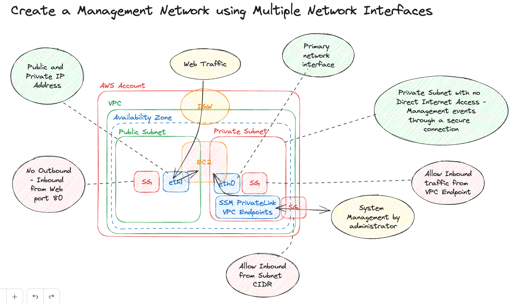

# AWS EC2 - Create an Instance with two ENI Attached to it
The purpose of this excercise is to run an ec2 instance with 2 Elastic Network Interface attached to it. One Network Interface should resides in a public subnet and one networking interface should reside in a private subnet. Attaching multiple network interfaces to an instance is useful when you want to create for example a management network.

## Requirements
- The primary network interface on the instance (eth0) handles backend management traffic.
- The secondary network interface on the instance (eth1) handles public traffic, and is located within the same Availability Zone (AZ) as the primary network interface.
- Create a simple VPC with one Public and one Private subnet within the same AZ
- Access the instance throught the private subnet
- For this scenario I would suggest to implement the SSM Management Interface Endpoints in the private subnet such as
    - `ec2messages.region.amazonaws.com`
    - `ssm.region.amazonaws.com`
    - `ssmmessages.region.amazonaws.com`
- Also I would recommend to launch an intsance from a marketplace - having NGINX or any reverse proxy preinstalled
- Also associate an Elastic IP Address with a network interface

## Desired Architecture

## Resources
[Network Interfaces Documentation](https://docs.aws.amazon.com/AWSEC2/latest/UserGuide/using-eni.html)