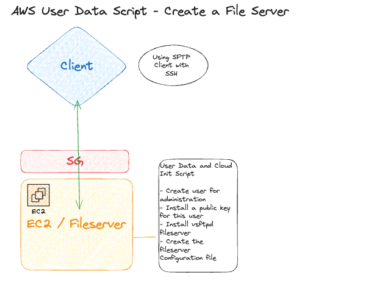

# AWS EC2 - Automate with User Data Script and Cloud Init
- When you launch an instance in Amazon EC2, you have the option of passing user data to the instance that can be used to perform common automated configuration tasks and even run scripts after the instance starts. 
- The purpose of this exercise is to demonstrate how you can take advantage using EC2 User Data script to automate common tasks. In the next Exercise I would like you to create a fileserver running on EC2

## Requirements

- Create fileserver using the `vsftpd` package.
- Use networking what you like
- Use User Data/Cloud init directives to finish the task
- Test with your local client 
- Bonus* -> Base64 encode the Userdata


## Desired Architecture


## Tips and Tricks
#### direct the Userdata output to the console
`exec > >(tee /var/log/user-data.log|logger -t user-data -s 2>/dev/console) 2>&1` 


#### Example Cloud Init Config of SFTP Server with an extra user to use
```yaml
#cloud-config
repo_update: true
repo_upgrade: all

packages:
- vsftpd

users:
- default
- name: sftpuser
  lock_passwd: true
  ssh_authorized_keys: 
  - ssh-rsa 
  +++++
    <and the rest of the public key>
  +++++
write_files:
- path: /etc/vsftpd/vsftpd.conf
  permission: '0600'
  content: |
    listen=YES
    anonymous_enable=NO
    local_enable=YES
    write_enable=YES
    local_umask=022
    dirmessage_enable=YES
    xferlog_enable=YES
    connect_from_port_20=YES
    xferlog_std_format=YES
    chroot_local_user=YES
    allow_writeable_chroot=YES


runcmd:
- systemctl enable vsftpd
- systemctl start vsftpd
```

#### Connect with SFTP Client using SSH Key
`sftp -i ~/.ssh/id_rsa <user>@<host>`

## Resources
- [User Data Script User Guide](https://docs.aws.amazon.com/AWSEC2/latest/UserGuide/user-data.html)
- [Cloud Init Reference](https://cloudinit.readthedocs.io/en/latest/reference/examples.html)
- [CloudFormation Cloud Init](https://docs.aws.amazon.com/AWSCloudFormation/latest/UserGuide/deploying.applications.html)
- [Connecting to SFTP Server with Public Key (SSH)](https://superuser.com/questions/1566901/how-do-i-connect-to-sftp-with-provided-ssh-key)
- [vsftpd configuration (fedora)](https://docs.fedoraproject.org/en-US/fedora/latest/system-administrators-guide/servers/File_and_Print_Servers/#s3-ftp-servers-vsftpd)