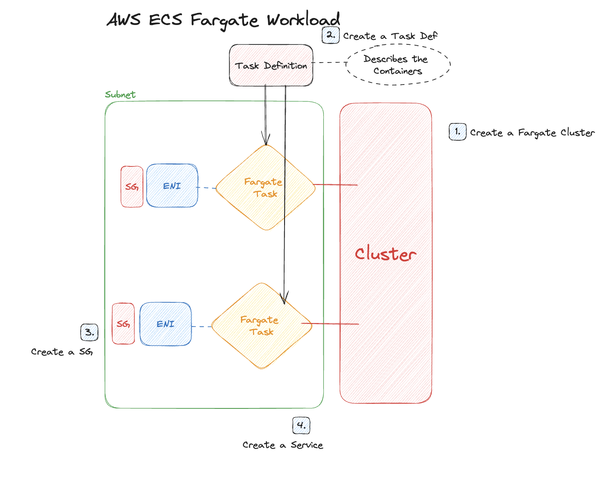

# AWS ECS - Create a Fargate Workload
- The Purpose of this exercise is experiment with ECS Fargate Workload offering. 
- An Amazon ECS cluster is a logical grouping of tasks or services. You can use clusters to isolate your applications. When your tasks are run on Fargate, your cluster resources are also managed by Fargate. 
- AWS Fargate is a technology that you can use with Amazon ECS to run containers without having to manage servers or clusters of Amazon EC2 instances. With Fargate, you no longer have to provision, configure, or scale clusters of virtual machines to run containers. This removes the need to choose server types, decide when to scale your clusters, or optimize cluster packing.
- You can run a standalone task, or you can run a task as part of a service.

## Architecture

## Requirements
1. Create an ECS Cluster with Fargate Capacity Provider
1. Create a Task Definition with any Container
    1. Have a Fargate task type defined
1. Create a SG for the Service
1. Create a Fargate Service
1. Clean Up! Don't Forget to Delete the Resources!

## Resources
1. [AWS Fargate User Guide](https://docs.aws.amazon.com/AmazonECS/latest/userguide/what-is-fargate.html)
1. [Creating a Task Definition](https://docs.aws.amazon.com/AmazonECS/latest/userguide/create-task-definition.html)
1. [Getting Started with Fargate](https://docs.aws.amazon.com/AmazonECS/latest/userguide/getting-started-fargate.html)