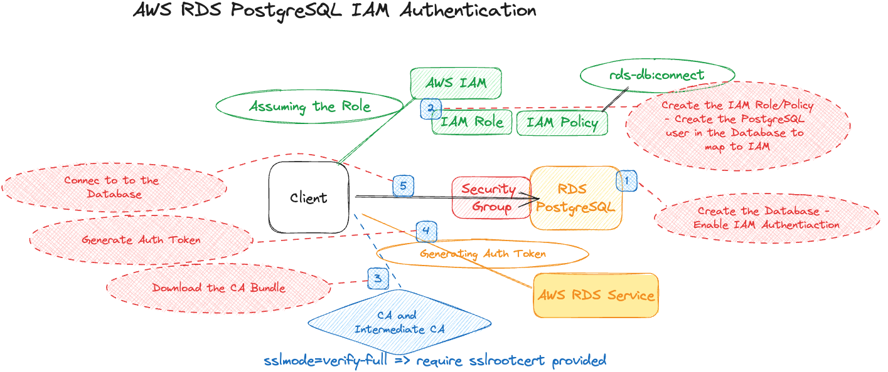

# AWS RDS - Use IAM Authentication (PostgreSQL)
- You can authenticate to your DB instance using AWS Identity and Access Management (IAM) database authentication. The purpose of this exercise is to get to know an additonal method to secure access to RDS Database Instances.
## Requirements
1. Create an RDS PostgreSQL Database (for myself at the point of recording v15.3 was used as Database Engine)
    - Use Defaults - make it publicly available
    - Enable IAM Authentication
1. Create the IAM Role/Policy
    - Create an User with IAM Credentials to Assume this Role
1. Create the Database User in the Server - map to IAM
1. Generate Auth Tokens
1. Connect to the Database

## Desired Architecture


## Tips and Tricks

#### Connecting to PostgreSQL with PSQL and ssmode=verify-full
```sh
psql "host=<db hostname> port=5432 user=postgres dbname=postgres sslmode=verify-full sslrootcert=/Users/<user>/Downloands/eu-central-1-bundle.pem"
```

#### Create database users and then grant them the rds_iam role
```sql
CREATE USER db_userx; 
GRANT rds_iam TO db_userx;
```

#### Generating an IAM authentication token
```
export RDSHOST="<rds host name>"
export PGPASSWORD="$(aws rds generate-db-auth-token --hostname $RDSHOST --port 5432 --region <region> --username <database username>)"
```

#### Connecting to the Database
```
psql "host=$RDSHOST port=5432 sslmode=verify-full sslrootcert=/sample_dir/global-bundle.pem dbname=DBName user=<database username> password=$PGPASSWORD"
```

#### Download the Certifications
- Select the right one from here (based on Region) -> [Download Links Here](https://docs.aws.amazon.com/AmazonRDS/latest/UserGuide/UsingWithRDS.SSL.html)

#### Db Access Permission Policy
```json
{
   "Version": "2012-10-17",
   "Statement": [
      {
         "Effect": "Allow",
         "Action": [
             "rds-db:connect"
         ],
         "Resource": [
             "arn:aws:rds-db:<region>:<account-id>:dbuser:<db-resource-id>/db_user"
         ]
      }
   ]
}
            
```

## Resources
1. [Using IAM with PostgreSQL](https://docs.aws.amazon.com/AmazonRDS/latest/UserGuide/UsingWithRDS.IAMDBAuth.DBAccounts.html)
1. [Creating and Using IAM Policy for RDS](https://docs.aws.amazon.com/AmazonRDS/latest/UserGuide/UsingWithRDS.IAMDBAuth.IAMPolicy.html)
1. [Using IAM within programming source code](https://docs.aws.amazon.com/AmazonRDS/latest/UserGuide/UsingWithRDS.IAMDBAuth.Connecting.Python.html)
1. [IAM Authentication with RDS in General](https://docs.aws.amazon.com/AmazonRDS/latest/UserGuide/UsingWithRDS.IAMDBAuth.html)
1. [RDS PEM Bundle - Download Links Here](https://docs.aws.amazon.com/AmazonRDS/latest/UserGuide/UsingWithRDS.SSL.html)

