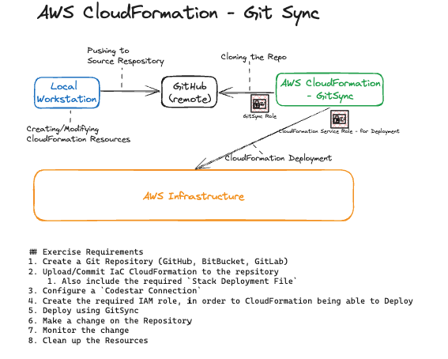

# AWS CloudFormation - Deploy with Git Sync
- With Git sync, you can manage your CloudFormation stacks with source control. You do this by configuring AWS CloudFormation to monitor a Git repository. The repository is monitored for changes to two files:
    - A CloudFormation template file that defines a stack
    - A stack deployment file that contains parameters that configure the stack

## Exercise Requirements
1. Create a Git Repository (GitHub, BitBucket, GitLab)
1. Upload IaC CloudFormation to the repsitory
    1. Also include the required `Stack Deployment File`
1. Configure a `Codestar Connection`
1. Create the required IAM role to CloudFormation in order to create the template
1. Deploy using GitSync
1. Make a change on the Repository
1. Monitor the change
1. Clean Up! Don't Forget to Delete the Resources!

## Quick Overview


## Tips and Tricks
#### GitSync Role
```json
{
    "Version": "2012-10-17",
    "Statement": [
        {
            "Sid": "SyncToCloudFormation",
            "Effect": "Allow",
            "Action": [
                "cloudformation:CreateChangeSet",
                "cloudformation:DeleteChangeSet",
                "cloudformation:DescribeChangeSet",
                "cloudformation:DescribeStackEvents",
                "cloudformation:DescribeStacks",
                "cloudformation:ExecuteChangeSet",
                "cloudformation:GetTemplate",
                "cloudformation:ListChangeSets",
                "cloudformation:ListStacks",
                "cloudformation:ValidateTemplate"
            ],
            "Resource": "*"
        },
        {
            "Sid": "PolicyForManagedRules",
            "Effect": "Allow",
            "Action": [
                "events:PutRule",
                "events:PutTargets"
            ],
            "Resource": "*",
            "Condition": {
                "StringEquals": {
                "events:ManagedBy": ["cloudformation.sync.codeconnections.amazonaws.com"]
                }
            }
        },
        {
            "Sid": "PolicyForDescribingRule",
            "Effect": "Allow",
            "Action": "events:DescribeRule",
            "Resource": "*"
        }
    ]
}
```

#### CloudFormation Service Role Deploying the VPC Stack
```json
{
    "Version": "2012-10-17",
    "Statement": [
        {
            "Sid": "DeployCloudFormation",
            "Effect": "Allow",
            "Action": "cloudformation:CreateChangeSet",
            "Resource": "*"
        },
        {
            "Sid": "DeployVPCResources",
            "Effect": "Allow",
            "Action": "ec2:*",
            "Resource": "*"
        }
    ]
}
```

##### CloudFormation Service Role - Trust Relationships/Assume Role Policy
```json
{
    "Version": "2012-10-17",
    "Statement": [
        {
            "Effect": "Allow",
            "Principal": {
                "Service": "cloudformation.amazonaws.com"
            },
            "Action": "sts:AssumeRole"
        }
    ]
}
```

## Resources
1. [Create a GitHub Connection](https://docs.aws.amazon.com/dtconsole/latest/userguide/connections-create-github.html)
2. [AWS CloudFormation Service Role](https://docs.aws.amazon.com/AWSCloudFormation/latest/UserGuide/using-iam-servicerole.html)