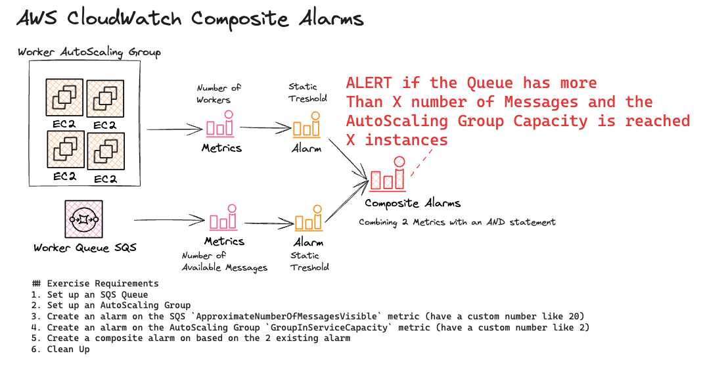

# AWS CloudWatch - Create a Composite Alarm
- With CloudWatch, you can combine several alarms into one composite alarm to create a summarized, aggregated health indicator over a whole application or group of resources. Composite alarms are alarms that determine their state by monitoring the states of other alarms. You define rules to combine the status of those monitored alarms using Boolean logic.

- You can use composite alarms to reduce alarm noise by taking actions only at an aggregated level. For example, you can create a composite alarm to send a notification to your developers if a Queue is starting to overflow and the workers cannot keep up.

- The purpose of this exercise is to know how to configure AWS CloudWatch Composite Alarms by combining multiple Alarms. 

## Exercise Requirements
1. Set up an SQS Queue
1. Set up an AutoScaling Group
1. Create an alarm on the SQS `ApproximateNumberOfMessagesVisible` metric (have a custom number like 20)
1. Create an alarm on the AutoScaling Group `GroupInServiceCapacity` metric (have a custom number like 2)
1. Create a composite alarm on based on the 2 existing alarm
1. Clean Up! Don't Forget to Delete the Resources!

## Quick Overview

## Resources
1. [AWS CloudWatch - Combining Alarms](./cloudwatch-composite-alarms-01.png)