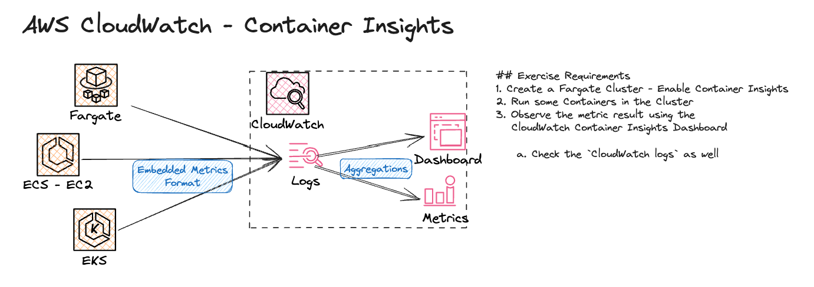

# AWS CloudWatch - Enable and Use Container Insights
- Use CloudWatch Container Insights to collect, aggregate, and summarize metrics and logs from your containerized applications and microservices. Container Insights is available for Amazon Elastic Container Service (Amazon ECS), Amazon Elastic Kubernetes Service (Amazon EKS), and Kubernetes platforms on Amazon EC2. Container Insights supports collecting metrics from clusters deployed on AWS Fargate for both Amazon ECS and Amazon EKS.

- CloudWatch automatically collects metrics for many resources, such as CPU, memory, disk, and network. Container Insights also provides diagnostic information, such as container restart failures, to help you isolate issues and resolve them quickly. You can also set CloudWatch alarms on metrics that Container Insights collects.

- Container Insights collects data as performance log events using embedded metric format. These performance log events are entries that use a structured JSON schema that enables high-cardinality data to be ingested and stored at scale.

- The purpose of this exercise is to get familiar with Container Insights. Container Insights can provide an easy way to observe Containerized Workloads.

## Exercise Requirements
1. Create a Fargate Cluster - Enable Container Insights
1. Run some Containers in the Cluster
1. Observe the metric result using the CloudWatch Container Insights Dashboard
    1. Check the `CloudWatch logs` as well
1. Clean Up! Don't Forget to Delete the Resources!

## Quick Overview

## Resources
1. [AWS Container Insights](https://docs.aws.amazon.com/AmazonCloudWatch/latest/monitoring/ContainerInsights.html)