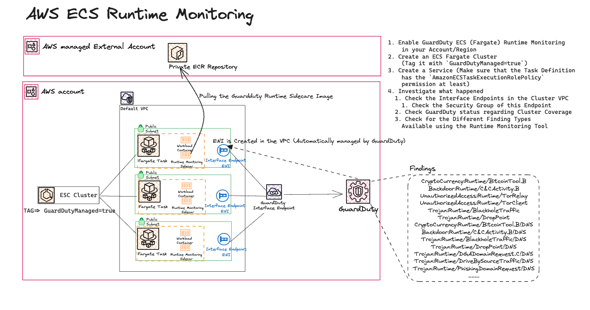

# AWS GuardDuty - Enable ECS Fargate Runtime Monitoring
- GuardDuty ECS Runtime Monitoring helps detect runtime events such as file access, process execution, and network connections that might indicate runtime threats. It checks hundreds of threat vectors and indicators and can produce over 30 different finding types. For example, it can detect attempts of privilege escalation, activity generated by crypto miners or malware, or activity suggesting reconnaissance by an attacker. 
- GuardDuty ECS Runtime Monitoring uses a managed and lightweight security agent that adds visibility into individual container runtime behaviors. When using AWS Fargate, there is no need for you to install, configure, manage, or update the agent.  This simplifies the management of your clusters and reduces the risk of leaving some tasks without monitoring. It also helps to improve your security posture and pass regulatory compliance and certification for runtime threats.
- In the Following Exercise we are going to Enable ECS Runtime monitoring, Discovering different finding types based on the documentation, and checking what is happening in the background.

## Exercise Requirements
1. Enable GuardDuty ECS (Fargate) Runtime Monitoring in your Account/Region
1. Create an ECS Fargate Cluster (Tag it with `GuardDutyManaged=true`)
1. Create a Service (Make sure that the Task Definition has the `AmazonECSTaskExecutionRolePolicy` permission at least)
1. Investigate what happened
    1. Check the Interface Endpoints in the Cluster VPC
        1. Check the Security Group of this Endpoint
    1. Check GuardDuty status regarding Cluster Coverage
    1. Check for the Different Finding Types Available using the Runtime Monitoring Tool
1. Clean Up! Don't Forget to Delete the Resources!

## Quick Overview

## Tips and Tricks
#### Set the Cluster Tag to ECS Managed to True
`GuardDutyManaged=true` setting on the ECS Cluster

## Resources
1. [Runtime Monitoring finding types](https://docs.aws.amazon.com/guardduty/latest/ug/runtime-monitoring.html)
1. [ECS Runtime Container Memory Limits](https://docs.aws.amazon.com/guardduty/latest/ug/prereq-runtime-monitoring-ecs-support.html#ecs-runtime-agent-cpu-memory-limits)
