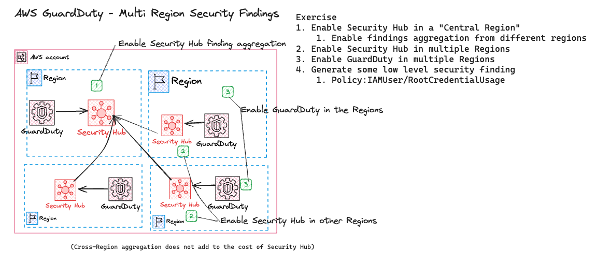

# AWS GuardDuty - Enable Multi Region Findings (AWS  Security Hub)
- The purpose of this exercise is to demonstrate how to centralize GuardDuaty Findings.
- Security Hub enables customers to have a centralized view into the security posture across their AWS environment by aggregating your security alerts from various AWS services and partner products in a standardized format so that you can more easily take action on them. To facilitate that central view, Security Hub allows you to designate an aggregation Region, which links some or all Regions to a single aggregated Region.

## Exercise
Exercise
1. Enable Security Hub in a "Central Region"
    1. Enable findings aggregation from different regions
2. Enable Security Hub in multiple Regions
3. Enable GuardDuty in multiple Regions
4. Generate some low level security finding
    1. Policy:IAMUser/RootCredentialUsage
1. Clean Up! Don't Forget to Delete the Resources!

## Quick Overview

## Tips and Tricks
#### 
#### Triggering Policy:IAMUser/RootCredentialUsage Finding
1. Log in to the AWS Account with the Root User Credentials

## Resources
1. [Security Hub finding Aggregations](https://docs.aws.amazon.com/securityhub/latest/userguide/finding-aggregation.html)
