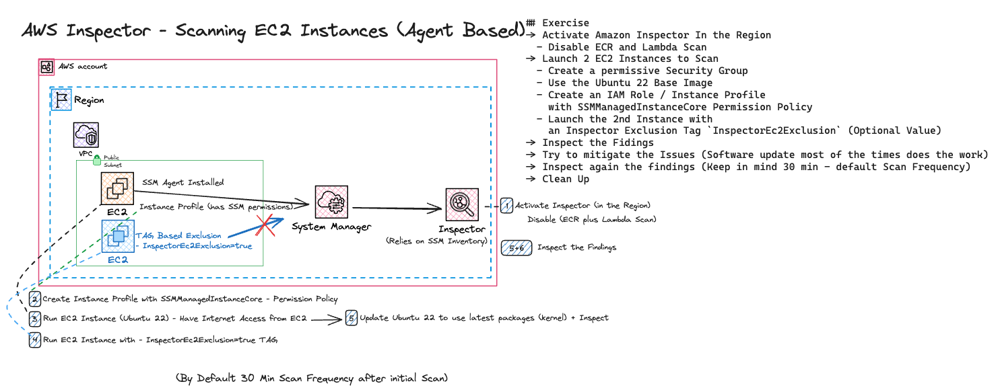

# AWS Inspector - Scanning EC2 Images for vulnerability detection 
- Amazon Inspector is a vulnerability management service that continuously scans your AWS workloads for software vulnerabilities and unintended network exposure. Amazon Inspector automatically discovers and scans running Amazon EC2 instances.
- Amazon Inspector creates a finding when it discovers a software vulnerability or network configuration issue. A finding describes the vulnerability, identifies the affected resource, rates the severity of the vulnerability, and provides remediation guidance. 
- The Purpose of this Exercise is to experiment with Inspector Agent Based EC2 Instance Scanning. 

## Exercise Requirements
1. Activate Amazon Inspector In the Region
    1. Disable ECR and Lambda Scan
1. Launch 2 EC2 Instances to Scan
    1. Create a permissive Security Group
    1. Use the Ubuntu 22 Base Image
    1. Create an IAM Role / Instance Profile with SSMManagedInstanceCore Permission Policy
    1. Launch the 2nd Instance with an Inspector Exclusion Tag `InspectorEc2Exclusion` (Optional Value)
1. Inspect the Fidings
1. Try to mitigate the Issues (Software update most of the times does the work)
1. Inspect again the findings (Keep in mind 30 min - default Scan Frequency)
1. Clean Up! Don't Forget to Delete the Resources!

## Quick Overview

## Tips and Tricks
#### Tag based Inspector Exclusion for EC2s
1. Use the `InspectorEc2Exclusion` Tag __KEY__ with an optional value to Exclude an Instance from Image Scanning

## Resources
1. [What is Amazon Inspector?](https://docs.aws.amazon.com/inspector/latest/user/what-is-inspector.html)
1. [Scanning Amazon EC2 instances with Amazon Inspector](https://docs.aws.amazon.com/inspector/latest/user/scanning-ec2.html)