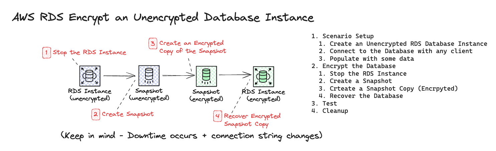

# AWS RDS - Encrypt unencrypted RDS Instance
- Amazon RDS can encrypt your Amazon RDS DB instances. Data that is encrypted at rest includes the underlying storage for DB instances, its automated backups, read replicas, and snapshots. Amazon RDS encrypted DB instances use the industry standard AES-256 encryption algorithm to encrypt your data on the server that hosts your Amazon RDS DB instances.
- It might be the case that you have provisioned your database without encryption enabled, there are multiple ways to encrypt an unencrypted database, In this exercise we are going to go with the safe way which involves application or client downtime.

## Exercise
1. Scenario Setup
  1. Create an Unencrypted RDS Database Instance
  1. Connect to the Database with any client
  1. Populate with some data
1. Encrypt the Database
  1. Stop the RDS Instance
  1. Create a Snapshot
  1. Crteate a Snapshot Copy (Encrpyted)
  1. Recover the Database
1. Test
1. Cleanup

## Quick Overview


## Tips and Tricks
#### Connecting to PostgreSQL Database
```sh
psql "host=<db hostname> port=5432 user=postgres dbname=postgres"
```

#### Example Data to populate the Database
```sql
-- Create the 'purchase' table
CREATE TABLE purchase (
    purchase_id SERIAL PRIMARY KEY,
    product_name VARCHAR(255),
    purchase_date DATE,
    quantity INT,
    total_price DECIMAL(10, 2)
);

-- Insert some sample data into the 'purchase' table
INSERT INTO purchase (product_name, purchase_date, quantity, total_price)
VALUES
    ('Product A', '2023-01-01', 3, 150),
    ('Product B', '2023-02-15', 2, 100),
    ('Product C', '2023-03-10', 1, 75),
    ('Product A', '2023-04-05', 5, 250),
    ('Product B', '2023-05-20', 4, 200);

-- Display the contents of the 'purchase' table
SELECT * FROM purchase;
```

## Resources
1. [RDS Database Encryption](https://docs.aws.amazon.com/AmazonRDS/latest/UserGuide/Overview.Encryption.html)
1. [Copying a DB Snapshot](https://docs.aws.amazon.com/AmazonRDS/latest/UserGuide/USER_CopySnapshot.html)