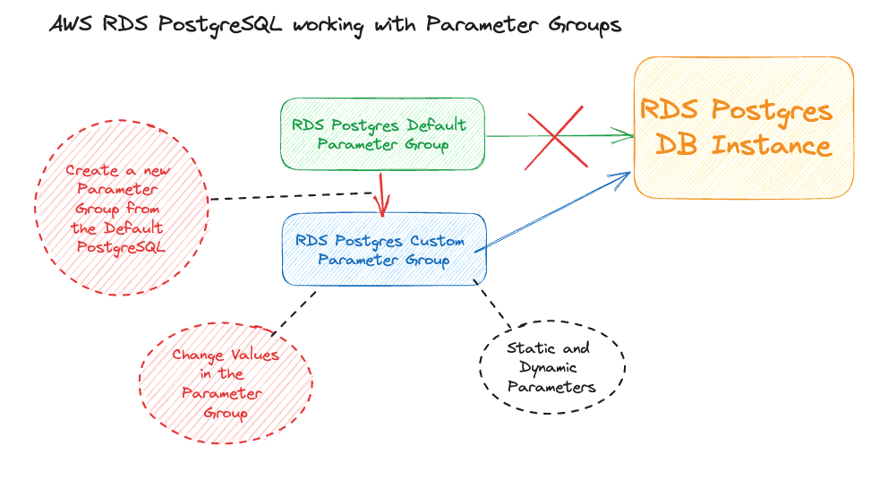

# AWS RDS - Working with Parameter Groups (PostgreSQL)
In the following lecture I would like to demonstrate how to work with Parameter Groups. First, get to know the default parameter group, later creating a custom PG and applying the custom parameter group to the DB Instance. We are going to work with PostgreSQL 15 Engine.

And as definition, DB parameter group acts as a container for engine configuration values that are applied to one or more DB instances. 

## Requirements
1. Create an RDS PostgreSQL Database (for myself at the point of recording v15.3 was used as Database Engine)
    - Use the Default Parameter Group (PGD)
1. Examine the Default Parameter Group (PGD)
1. Create a new Parameter Group (PG2)
1. Change the RDS parameter group to the new Parameter Group (PG2)
1. Change values within the RDS parameter group (PG2)
    1. good candidates for changes
        1. `max_connections` for STATIC parameter,
        1. `log_collection_age` for DYNAMIC parameter
1. Connect to the Database and examine the values that you have changed

## Desired Architecture


## Tips and Tricks
#### Connecting to PostgreSQL Database
```sh
psql "host=<db hostname> port=5432 user=postgres dbname=postgres"
```

## Resources
1. [Working with RDS Parameter Groups](https://docs.aws.amazon.com/AmazonRDS/latest/UserGuide/USER_WorkingWithParamGroups.html)
1. [Working with RDS Postgres Parameters](https://docs.aws.amazon.com/AmazonRDS/latest/UserGuide/Appendix.PostgreSQL.CommonDBATasks.Parameters.html)
1. [Postgres Tuning Guide](https://postgresqlco.nf/tuning-guide)
