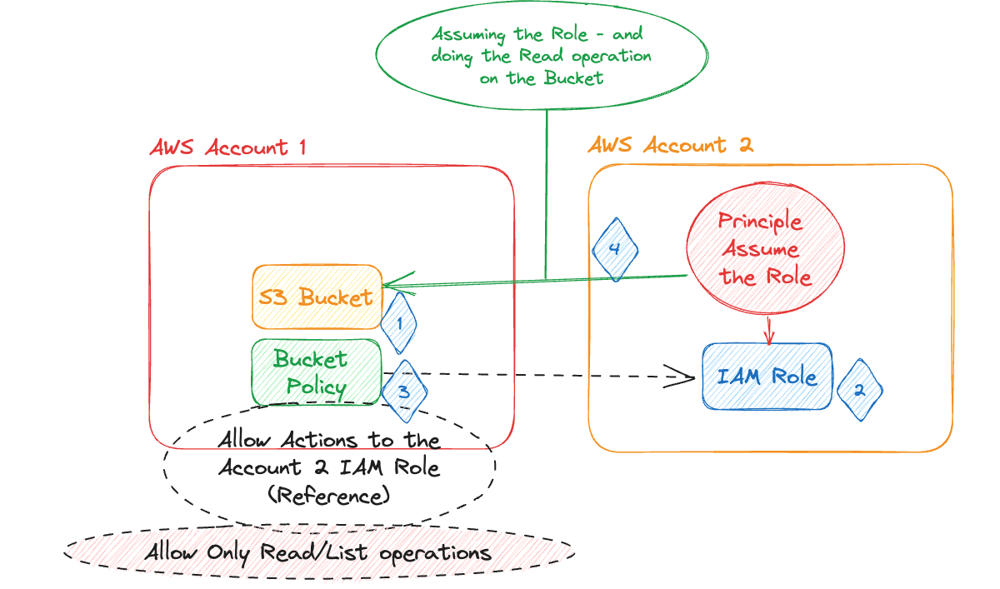

# AWS EC2 - S3 Cross Account Access
The purpose of this excercise is to demonstrate how to access S3 Objects from a different AWS Account - called "Cross Account S3 Access"

## Requirements
- Have 2 Different AWS Accounts (Hard Requirement) (Account A / Account B)
- Create a Bucket in Account A (Or Reuse an existing S3 Bucket if you have it ready)
    - Upload Objects to the Bucket
- Access the S3 Bucket from "Account B"

## Desired Architecture


## Tips and Tricks
#### CloudShell AWS Credential Configuration for Cross Account Access

```txt
# ~/.aws/config file
[profile training-cross-account-role]
role_arn = arn:aws:iam::<Account B>:role/Training2CrossAccountRole
credential_source = EcsContainer
```

#### S3 List Objects in a Bucket with CLI
```sh
aws s3api list-objects-v2 --bucket <bucket in Account A> --profile training-cross-account-role
```

#### Bucket Policy Allow Read Operations
```json
{
    "Sid": "CrossAccountFetch",
    "Effect": "Allow",
    "Principal": {
        "AWS": "arn:aws:iam::<Account B>:role/Training2CrossAccountRole"
    },
    "Action": [
        "s3:ListBucket",
        "s3:ListBucketVersions",
        "s3:GetObject",
        "s3:GetObjectVersion"
    ],
    "Resource": [
        "arn:aws:s3:::<S3 Bucket>/*",
        "arn:aws:s3:::<S3 Bucket>"
    ]
}
```

#### Account B - Permission Policy for IAM Role (Training2CrossAccountRole)
```json
{
    "Version": "2012-10-17",
    "Statement": [
        {
            "Effect": "Allow",
            "Action": [
                "s3:ListBucket",
                "s3:ListBucketVersions",
                "s3:GetObject",
                "s3:GetObjectVersion"
            ],
            "Resource": [
                "arn:aws:s3:::<S3 Bucket>/*",
                "arn:aws:s3:::<S3 Bucket>"
            ]
        }
    ]
}
```

#### Account B - Assume Role Policy for IAM Role (Training2CrossAccountRole)
```json
{
    "Version": "2012-10-17",
    "Statement": [
        {
            "Sid": "Statement1",
            "Effect": "Allow",
            "Principal": {
                "AWS": "arn:aws:iam::<Account B:user/<User>"
            },
            "Action": "sts:AssumeRole"
        }
    ]
}
```

## Resources
1. [S3 Cross Account Permissions](https://docs.aws.amazon.com/AmazonS3/latest/userguide/example-walkthroughs-managing-access-example2.html)